# Git Basics

## The Git Workflow

A typical Git workflow involves these areas:

- **Working Directory:** Where you edit files.
- **Staging Area:** Where you prepare files for commit.
- **Local Repository:** Where commits are stored on your computer.
- **Remote Repository:** Where your project is backed up and shared (e.g., on GitHub).

```mermaid
flowchart TD
	style WD fill:#E3F2FD,stroke:#2196F3,stroke-width:2px
	style STG fill:#FFF9C4,stroke:#FBC02D,stroke-width:2px
	style LOCAL fill:#C8E6C9,stroke:#388E3C,stroke-width:2px
	style REMOTE fill:#FFCDD2,stroke:#D32F2F,stroke-width:2px

	WD["📂 Working Directory"]
	STG["🗃️ Staging Area"]
	LOCAL["📦 Local Repository"]
	REMOTE["🌐 Remote Repository"]

	WD -->|git add| STG
	STG -->|git commit| LOCAL
	LOCAL -->|git push| REMOTE
	REMOTE -->|git fetch / git pull| LOCAL
	LOCAL -->|git checkout| WD
```




### Basic Commands

#### Set up your Git environment
```bash
git config --global user.name "Your Name"
git config --global user.email "you@example.com"
```

#### Initialize a new repository
```bash
git init my_first_project
cd my_first_project
```

#### Add and commit files
```bash
echo "Hello Git" > README.md
git add README.md
git commit -m "Initial commit"
```

#### View history
```bash
git log --oneline --graph
```

#### Branching and merging
```bash
git checkout -b feature-idea
git add .
git commit -m "Add awesome feature"
git checkout main
git merge feature-idea
```

#### Stash changes
```bash
git stash
git stash list
git stash apply
git stash pop
git stash drop
```

#### Rebase
```bash
git checkout feature-branch
git rebase main
git add <file>
git rebase --continue
```

#### Restore & reset
```bash
git restore --staged <file>
git reset --soft HEAD~1
git reset --hard HEAD~1
git checkout HEAD -- <file>
```

#### See who edited a file
```bash
git blame my_script.py
```

These commands form the foundation of working with Git.

