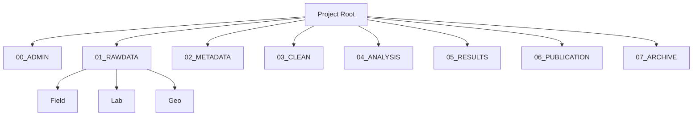
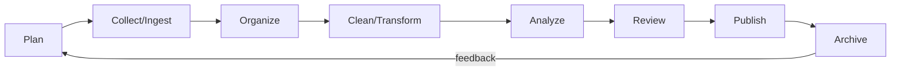

# Diagrams

## Project Folder Structure

```mermaid
flowchart TD
    A[Project Root]
    A --> B[00_ADMIN]
    A --> C[01_RAWDATA]
    C --> C1[Field]
    C --> C2[Lab]
    C --> C3[Geo]
    A --> D[02_METADATA]
    A --> E[03_CLEAN]
    A --> F[04_ANALYSIS]
    A --> G[05_RESULTS]
    A --> H[06_PUBLICATION]
    A --> I[07_ARCHIVE]
```

## Data Lifecycle

```mermaid
flowchart LR
    P[Plan] --> I[Collect/Ingest]
    I --> O[Organize]
    O --> T[Clean/Transform]
    T --> A[Analyze]
    A --> R[Review]
    R --> U[Publish]
    U --> V[Archive]
    V -->|feedback| P
```
