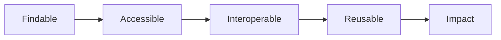

# FAIR in Practice (Quick Guide)

FAIR means data and software are Findable, Accessible, Interoperable, and Reusable. Below is a practical, lightweight checklist with pointers into the handbook.

## Findable
- Use clear names and stable locations
- Add metadata (README + data dictionary + schema)
- Register a DOI for datasets and releases

## Accessible
- Publish open by default (unless restricted)
- Choose permissive licenses (CC BY for data, MIT for code)
- Archive artifacts (datasets, software) in trusted repositories

## Interoperable
- Prefer open, tabular formats (CSV/TSV, Parquet for big data)
- Use controlled vocabularies and units; validate with schemas
- Document transformations and pipelines

## Reusable
- Provide provenance: who, what, when, how
- Include examples and validation rules
- Write clear terms of use and citation instructions

## Quick diagram

See also:
- Metadata & Documentation → detailed templates and schema examples
- Publishing & Reuse → DOIs, repositories, `CITATION.cff`
- Data Quality → validation with pandera/pointblank
