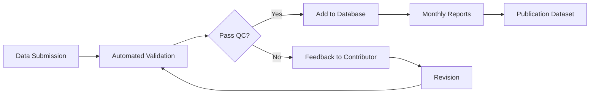

# Case Studies: Real-World Transformations

These case studies show how research teams transformed chaotic projects into well-organized, reproducible workflows. Each example demonstrates the practical application of principles from this handbook.

## Case Study 1: The Messy Spreadsheet Project

### The Challenge
**Project:** Multi-year biodiversity monitoring across 15 field sites  
**Team:** 3 graduate students, 1 postdoc, 1 PI  
**Timeline:** 4 years of data collection  

### Before: The Chaos
- **50+ Excel files** scattered across personal laptops and shared drives
- **Inconsistent naming:** `site1_data.xlsx`, `Site_2_final.xlsx`, `SITE3_BACKUP_USE_THIS.xlsx`
- **No documentation:** Column meanings forgotten, units unclear
- **Manual analysis:** Copy-paste between files, different formulas in each
- **Version confusion:** Multiple "final" versions, no change tracking
- **Collaboration nightmare:** Email attachments, overwritten work

### The Breaking Point
*"We spent 3 weeks trying to recreate an analysis from 6 months ago. The Excel file was corrupted, and we couldn't remember which sites were included. We almost had to re-collect an entire season of data."* - Graduate student

### After: The Transformation

#### 1. Data Organization
```
biodiversity_monitoring/
├── data/
│   ├── raw/                     # Original, untouched data
│   │   ├── 2021_site_01.csv
│   │   ├── 2021_site_02.csv
│   │   └── ...
│   ├── processed/               # Clean, analysis-ready data
│   │   ├── combined_species_counts.csv
│   │   └── site_environmental_data.csv
│   └── metadata/
│       ├── data_dictionary.csv  # Column definitions
│       ├── site_coordinates.csv # Location information
│       └── README.md           # Collection protocols
├── scripts/
│   ├── 01_data_cleaning.R
│   ├── 02_species_analysis.R
│   └── 03_generate_report.R
├── results/
│   ├── figures/
│   └── tables/
└── docs/
    ├── field_protocols.md
    └── analysis_methods.md
```

#### 2. Standardized Data Format
**Before:**
| Date | Site | Sp1 | Sp2 | Notes |
|------|------|-----|-----|-------|
| 5/1 | A | 12 | 3 | sunny |

**After:**
| date | site_id | species_code | count | weather | collector_id | data_quality |
|------|---------|--------------|-------|---------|--------------|--------------|
| 2021-05-01 | SITE_01 | FAGR_SYL | 12 | sunny | JS | verified |
| 2021-05-01 | SITE_01 | QUER_ROB | 3 | sunny | JS | verified |

#### 3. Automated Pipeline
```r
# 01_data_cleaning.R
source("scripts/functions/data_validation.R")
raw_files <- list.files("data/raw", pattern = "*.csv")
cleaned_data <- map_dfr(raw_files, process_site_data)
write_csv(cleaned_data, "data/processed/combined_species_counts.csv")

# 02_species_analysis.R
data <- read_csv("data/processed/combined_species_counts.csv")
diversity_metrics <- calculate_diversity_indices(data)
generate_species_accumulation_curves(data)

# 03_generate_report.R
render("reports/annual_biodiversity_report.Rmd")
```

#### 4. Version Control & Collaboration
- **Git repository** with clear commit messages
- **Branching strategy:** Each analysis gets its own branch
- **Issue tracking:** Document questions and decisions
- **Automated backups** to institutional repository

### The Results

#### Immediate Benefits
- **Time savings:** Analysis that took 2 days now runs in 20 minutes
- **Error reduction:** Automated validation catches inconsistencies
- **Collaboration:** Team members can work simultaneously without conflicts
- **Transparency:** Every change is documented and reversible

#### Long-term Impact
- **Reproducibility:** Paper reviewers could verify all results
- **Reusability:** Methods adapted by 3 other research groups
- **Career benefits:** Students gained valuable data science skills
- **Grant success:** Funders impressed by data management plan

### Key Lessons

1. **Start with file organization** - establish folder structure first
2. **Standardize early** - agree on naming conventions and formats
3. **Document everything** - your future self will thank you
4. **Automate repetitive tasks** - invest time upfront to save time later
5. **Use version control** - even for small projects
6. **Train the whole team** - everyone needs to follow the same practices

---

## Case Study 2: The Lost Experiment Recovery

### The Challenge
**Project:** Climate chamber experiment with 500 plant samples  
**Crisis:** Laboratory computer crashed, backup corrupted  
**Timeline:** 6 months of work at risk  

### Before: Single Point of Failure
- All data on one lab computer
- Backup drive stored next to computer (damaged in same incident)
- Analysis scripts mixed with data files
- No documentation of experimental design changes
- Temperature sensor calibration data only in lab notebook

### The Recovery Process

#### 1. Emergency Data Archaeology
- Recovered partial Excel files from email attachments
- Reconstructed missing measurements from lab notebook photos
- Cross-referenced with collaborator's notes from site visits
- Used temperature sensor manufacturer's calibration certificates

#### 2. Implementing Robust Backup Strategy
```
experiment_2023/
├── data/
│   ├── raw/                    # Automatically synced to cloud
│   ├── processed/              # Generated from scripts
│   └── backup/                 # Weekly snapshots
├── scripts/                    # Version controlled
├── lab_notebook/               # Scanned daily
├── protocols/                  # Shared with team
└── calibration/               # Sensor certificates
```

#### 3. Real-time Data Protection
- **Automatic cloud sync** every hour
- **Git repository** for all scripts and documentation
- **Database backup** to university servers
- **Encrypted external drive** stored off-site
- **Digital lab notebook** with daily entries

### After: Bulletproof Workflow

#### Data Collection
```python
# Automated data logging with validation
import pandas as pd
from datetime import datetime

def log_measurement(chamber_id, temperature, humidity, sample_id):
    # Validate inputs
    validate_chamber_id(chamber_id)
    validate_sensor_reading(temperature, humidity)
    
    # Log to database
    timestamp = datetime.now()
    log_entry = {
        'timestamp': timestamp,
        'chamber_id': chamber_id,
        'temperature_c': temperature,
        'humidity_percent': humidity,
        'sample_id': sample_id,
        'operator': get_current_user()
    }
    
    # Save locally and sync to cloud
    save_to_database(log_entry)
    sync_to_cloud()
    
    return log_entry
```

#### Quality Control Dashboard
```r
# Real-time monitoring script
library(shiny)
library(plotly)

# Dashboard shows:
# - Current conditions in each chamber
# - Alert if values out of range
# - Data collection completeness
# - Backup status indicators
```

### The Results
- **Zero data loss** since implementation
- **Faster analysis** with automated quality checks
- **Improved collaboration** with real-time data sharing
- **Student confidence** - no fear of losing months of work
- **Reproducible results** - exact conditions can be recreated

---

## Case Study 3: The Multi-Institution Collaboration Maze

### The Challenge
**Project:** Global soil carbon database  
**Partners:** 12 institutions across 6 countries  
**Data:** 50,000 soil samples, 200+ variables  
**Timeline:** 5-year collaboration  

### Before: Tower of Babel
- Each institution used different data formats
- Conflicting measurement units (metric vs. imperial)
- Various software packages (R, Python, MATLAB, SPSS)
- Email chains with 47 people
- Language barriers in documentation
- No standard quality control procedures

### After: Harmonized Workflow

#### 1. Universal Data Standard
```csv
# soil_carbon_template.csv - used by all partners
sample_id,collection_date,latitude,longitude,depth_cm,carbon_percent,ph,texture_class,land_use,notes
SC_2023_0001,2023-03-15,52.5200,13.4050,15,2.34,6.8,loam,forest,morning_collection
```

#### 2. Automated Data Validation
```python
# validate_submission.py - runs before data acceptance
def validate_soil_sample(data_file):
    checks = [
        validate_coordinates(),      # GPS coordinates reasonable?
        validate_date_format(),      # ISO 8601 standard?
        validate_measurement_units(), # All metric?
        validate_required_fields(),   # No missing critical data?
        check_value_ranges(),        # pH between 0-14, etc.
        detect_duplicates()          # Same sample submitted twice?
    ]
    return generate_validation_report(checks)
```

#### 3. Collaborative Infrastructure
- **Shared GitHub organization** with team permissions
- **Automated translation** of key documentation
- **Monthly video calls** with rotating time zones
- **Slack workspace** for quick questions
- **Shared computing resources** on cloud platform

#### 4. Quality Assurance Pipeline


### The Results
- **Standardized dataset** used by 50+ research papers
- **Faster integration** - new partners onboarded in days, not months
- **Higher data quality** - error rate reduced by 85%
- **Sustainable collaboration** - framework adopted by other networks
- **Career advancement** - junior researchers gained international visibility

---

## Case Study 4: The Legacy Data Rescue

### The Challenge
**Situation:** Retiring professor's 30-year research archive  
**Data:** 500GB across floppy disks, CDs, and old hard drives  
**Formats:** Mix of obsolete software formats  
**Documentation:** Handwritten notes, some illegible  

### The Rescue Mission

#### 1. Digital Archaeology
- **Hardware recovery:** Found working computers for old formats
- **Format conversion:** Migrated data through multiple software versions
- **OCR scanning:** Digitized handwritten lab notebooks
- **Metadata reconstruction:** Interviewed the professor before retirement

#### 2. Modern Archive Structure
```
legacy_research_archive/
├── original_data/              # Exact copies of recovered files
├── converted_data/             # Modern formats
├── documentation/
│   ├── lab_notebooks_scanned/
│   ├── protocols_reconstructed/
│   └── interview_transcripts/
├── code/
│   ├── conversion_scripts/
│   └── analysis_recreation/
└── metadata/
    ├── file_inventory.csv
    ├── format_conversion_log.csv
    └── data_dictionary.csv
```

#### 3. Knowledge Preservation
```markdown
# dataset_context.md
## Historical Context
This dataset represents 30 years of groundwater monitoring...

## Methodology Evolution
- 1990-1995: Manual measurements with analog instruments
- 1996-2005: Digital sensors, Excel analysis
- 2006-2015: Database storage, R scripts
- 2016-2020: Automated monitoring, cloud storage

## Known Issues
- Temperature data from 1993-1994 may be offset by +2°C
- Site relocations documented in lab_notebook_vol_15.pdf
- Equipment upgrade in 2008 changed measurement precision
```

### The Results
- **30 years of data** preserved for future research
- **3 PhD dissertations** built on rediscovered datasets
- **Historical baselines** for climate change studies
- **Methodology documentation** preventing knowledge loss
- **Template process** for other retirement transitions

---

## Implementation Roadmap

### For Your Own Project Transformation

#### Week 1: Assessment
- [ ] Document current state (take screenshots!)
- [ ] Identify biggest pain points
- [ ] Estimate time investment for improvement
- [ ] Get team buy-in

#### Week 2-3: Foundation
- [ ] Establish folder structure
- [ ] Set up version control
- [ ] Create data dictionary template
- [ ] Draft naming conventions

#### Week 4-6: Migration
- [ ] Move files to new structure (keep backups!)
- [ ] Start documenting as you go
- [ ] Convert critical analysis to scripts
- [ ] Set up automated backups

#### Month 2-3: Refinement
- [ ] Train team members
- [ ] Establish workflows
- [ ] Create quality checks
- [ ] Document lessons learned

### Success Metrics
- Time to reproduce an analysis
- Number of "where is that file?" questions
- Team confidence in data integrity
- External collaboration ease
- Publication and sharing success

---

*These case studies are based on real experiences but anonymized to protect privacy. Contact the handbook maintainers to share your own transformation story!*