# Decision Trees & Flowcharts

These interactive decision trees help you choose the right tools and approaches for your specific research situation. Follow the flowcharts to get personalized recommendations.

## 1. Version Control Strategy Decision Tree

```mermaid
flowchart TD
    A[New Research Project] --> B{What type of data?}
    
    B -->|Code only| C{Team size?}
    B -->|Small datasets<br/>< 100MB total| D{Collaboration needed?}
    B -->|Medium datasets<br/>100MB - 2GB| E[Git + Git LFS]
    B -->|Large datasets<br/>> 2GB| F{Budget available?}
    
    C -->|Solo researcher| G[Git + GitHub]
    C -->|2-5 people| H[Git + GitHub/GitLab]
    C -->|> 5 people| I[Git + Enterprise hosting]
    
    D -->|No collaboration| J[Git + local backup]
    D -->|Yes, with colleagues| K[Git + GitHub]
    D -->|Yes, public sharing| L[Git + GitHub + Zenodo]
    
    E --> M{Collaboration level?}
    M -->|Internal team| N[Git LFS + GitHub]
    M -->|Public sharing| O[Git LFS + separate data repository]
    
    F -->|Yes| P[Git + DVC + cloud storage]
    F -->|No/Limited| Q[Git + institutional storage]
    
    G --> R[✅ Simple workflow<br/>📁 Local + GitHub backup]
    H --> S[✅ Branching workflow<br/>🔄 Pull requests<br/>📋 Issue tracking]
    I --> T[✅ Advanced permissions<br/>🏢 Enterprise features<br/>📊 Analytics]
    
    J --> U[✅ Version history<br/>💾 External drive backup]
    K --> V[✅ Real-time collaboration<br/>🌐 Cloud backup<br/>📱 Mobile access]
    L --> W[✅ Public visibility<br/>🏷️ DOI assignment<br/>📄 Citation tracking]
    
    N --> X[✅ Large file support<br/>👥 Team access<br/>📈 Version tracking]
    O --> Y[✅ Public datasets<br/>🏷️ Separate DOIs<br/>📚 Data repositories]
    
    P --> Z[✅ Unlimited storage<br/>🚀 Fast sync<br/>💰 Pay-per-use]
    Q --> AA[✅ Free storage<br/>🏫 IT support<br/>📋 Compliance built-in]
    
    style R fill:#d4edda
    style S fill:#d4edda
    style T fill:#d4edda
    style U fill:#d4edda
    style V fill:#d4edda
    style W fill:#d4edda
    style X fill:#d4edda
    style Y fill:#d4edda
    style Z fill:#d4edda
    style AA fill:#d4edda
```

**Quick Decision Helper:**
- **Just code, working alone?** → Git + GitHub
- **Small team, mixed files?** → Git + GitHub
- **Large data files?** → Git + LFS or DVC
- **Huge datasets?** → Git + DVC + cloud storage

---

## 2. Data Storage & Backup Strategy

```mermaid
flowchart TD
    A[Research Data] --> B{Data sensitivity?}
    
    B -->|Public/Open| C{Data size?}
    B -->|Internal only| D{Institutional policy?}
    B -->|Sensitive/Personal| E[Institutional secure storage<br/>+ encryption + access controls]
    
    C -->|< 1GB| F[GitHub repository]
    C -->|1GB - 50GB| G{Long-term preservation?}
    C -->|> 50GB| H[Research data repository<br/>+ DOI]
    
    G -->|Yes| I[Zenodo/Figshare<br/>+ institutional backup]
    G -->|Short-term| J[GitHub LFS<br/>+ cloud backup]
    
    D -->|Strict policies| K[Use institutional systems only]
    D -->|Flexible| L{Budget for cloud?}
    
    L -->|Yes| M[Hybrid: institutional + cloud]
    L -->|No| N[Institutional storage + external drives]
    
    F --> O[✅ Version control integrated<br/>✅ Automatic backup<br/>✅ Easy sharing]
    
    I --> P[✅ Permanent DOI<br/>✅ Long-term preservation<br/>✅ Citation tracking]
    
    J --> Q[✅ Version history<br/>✅ Team collaboration<br/>⚠️ Storage limits]
    
    H --> R[✅ Professional hosting<br/>✅ Metadata standards<br/>✅ Discovery tools]
    
    E --> S[✅ Security compliance<br/>✅ Access logging<br/>✅ IT support]
    
    K --> T[✅ Policy compliance<br/>✅ IT support<br/>⚠️ Limited flexibility]
    
    M --> U[✅ Best of both worlds<br/>✅ Redundancy<br/>💰 Higher cost]
    
    N --> V[✅ Cost effective<br/>✅ IT support<br/>⚠️ Manual backup needed]
    
    style O fill:#d4edda
    style P fill:#d4edda
    style Q fill:#fff3cd
    style R fill:#d4edda
    style S fill:#d4edda
    style T fill:#fff3cd
    style U fill:#d4edda
    style V fill:#fff3cd
```

---

## 3. Programming Environment Setup

```mermaid
flowchart TD
    A[Choose Development Environment] --> B{Primary language?}
    
    B -->|R| C{Project complexity?}
    B -->|Python| D{Project type?}
    B -->|Mixed/Multiple| E[Use containers<br/>Docker/Singularity]
    
    C -->|Simple analysis| F[RStudio + renv]
    C -->|Package development| G[RStudio + renv + devtools]
    C -->|Reproducible reports| H[RStudio + Quarto/R Markdown]
    
    D -->|Data analysis| I{Collaboration level?}
    D -->|Machine learning| J[conda/mamba + Jupyter]
    D -->|Web applications| K[pip + virtual environments]
    D -->|Scientific computing| L[conda + JupyterLab]
    
    I -->|Solo| M[pip + venv]
    I -->|Team| N[conda + environment.yml]
    
    F --> O[✅ Simple setup<br/>📦 Automatic dependencies<br/>🔄 Easy sharing]
    
    G --> P[✅ Package testing<br/>📋 Documentation tools<br/>🚀 CRAN submission ready]
    
    H --> Q[✅ Literate programming<br/>📄 Multiple output formats<br/>🔄 Version control friendly]
    
    M --> R[✅ Lightweight<br/>⚡ Fast setup<br/>🐍 Pure Python]
    
    N --> S[✅ Cross-platform<br/>👥 Team consistency<br/>📦 Easy environment sharing]
    
    J --> T[✅ GPU support<br/>📊 Rich visualizations<br/>🤖 ML libraries included]
    
    K --> U[✅ Production ready<br/>🌐 Web deployment<br/>📦 Minimal overhead]
    
    L --> V[✅ Scientific stack<br/>📈 Advanced notebooks<br/>🔬 Research optimized]
    
    E --> W[✅ Complete isolation<br/>🖥️ Any OS<br/>📦 Includes system dependencies]
    
    style O fill:#d4edda
    style P fill:#d4edda
    style Q fill:#d4edda
    style R fill:#d4edda
    style S fill:#d4edda
    style T fill:#d4edda
    style U fill:#d4edda
    style V fill:#d4edda
    style W fill:#d4edda
```

---

## 4. Data Sharing & Publication Workflow

```mermaid
flowchart TD
    A[Ready to Share Data?] --> B{Data type?}
    
    B -->|Tabular data<br/>< 1GB| C{Reuse potential?}
    B -->|Large datasets<br/>> 1GB| D{Domain-specific?}
    B -->|Code + data| E{Software focus?}
    B -->|Sensitive data| F[Prepare anonymized subset<br/>+ detailed documentation]
    
    C -->|High| G[General repository<br/>Zenodo, Figshare]
    C -->|Domain-specific| H[Field repository<br/>e.g., GenBank, GBIF]
    
    D -->|Yes| I[Domain repository<br/>+ institutional backup]
    D -->|No| J[General repository<br/>+ compressed formats]
    
    E -->|Code primary| K{Code quality?}
    E -->|Data primary| L[Data repository<br/>+ code supplement]
    
    K -->|Research quality| M[GitHub + Zenodo]
    K -->|Production ready| N[CRAN/PyPI + GitHub]
    
    F --> O{Ethics approval?}
    O -->|Yes| P[Institutional repository<br/>+ access controls]
    O -->|No| Q[Seek ethics guidance first]
    
    G --> R[✅ Broad discoverability<br/>✅ DOI assignment<br/>✅ Citation metrics]
    
    H --> S[✅ Domain standards<br/>✅ Specialist tools<br/>✅ Community visibility]
    
    I --> T[✅ Optimized storage<br/>✅ Field-specific metadata<br/>✅ Integration tools]
    
    J --> U[✅ General access<br/>✅ Long-term preservation<br/>⚠️ Size limits may apply]
    
    M --> V[✅ Code + data together<br/>✅ Version synchronization<br/>✅ Issue tracking]
    
    N --> W[✅ Wide distribution<br/>✅ Easy installation<br/>✅ Community adoption]
    
    L --> X[✅ Data focus<br/>✅ Supplementary code<br/>✅ Comprehensive metadata]
    
    P --> Y[✅ Controlled access<br/>✅ Usage tracking<br/>✅ Compliance assured]
    
    Q --> Z[⚠️ Ethics review needed<br/>📋 Document considerations<br/>🔒 Delay publication if needed]
    
    style R fill:#d4edda
    style S fill:#d4edda
    style T fill:#d4edda
    style U fill:#fff3cd
    style V fill:#d4edda
    style W fill:#d4edda
    style X fill:#d4edda
    style Y fill:#d4edda
    style Z fill:#f8d7da
```

---

## 5. Project Structure Decision Tree

```mermaid
flowchart TD
    A[New Project Setup] --> B{Project duration?}
    
    B -->|< 6 months| C{Team size?}
    B -->|6 months - 2 years| D{Outputs expected?}
    B -->|> 2 years| E[Complex project structure<br/>+ documentation system]
    
    C -->|Solo| F[Simple structure<br/>basic documentation]
    C -->|2-5 people| G[Standard structure<br/>+ collaboration tools]
    
    D -->|Data analysis only| H[Analysis-focused structure]
    D -->|Multiple outputs| I[Multi-output structure]
    D -->|Software development| J[Package development structure]
    
    F --> K[```<br/>project/<br/>├── data/<br/>├── scripts/<br/>├── results/<br/>└── README.md<br/>```]
    
    G --> L[```<br/>project/<br/>├── data/<br/>│   ├── raw/<br/>│   └── processed/<br/>├── scripts/<br/>├── results/<br/>├── docs/<br/>└── README.md<br/>```]
    
    H --> M[```<br/>project/<br/>├── data/<br/>│   ├── raw/<br/>│   ├── processed/<br/>│   └── metadata/<br/>├── analysis/<br/>├── results/<br/>│   ├── figures/<br/>│   └── tables/<br/>├── reports/<br/>└── README.md<br/>```]
    
    I --> N[```<br/>project/<br/>├── data/<br/>├── analysis/<br/>├── manuscripts/<br/>├── presentations/<br/>├── software/<br/>├── results/<br/>└── documentation/<br/>```]
    
    J --> O[```<br/>package/<br/>├── src/<br/>├── tests/<br/>├── docs/<br/>├── examples/<br/>├── data/<br/>├── vignettes/<br/>└── DESCRIPTION<br/>```]
    
    E --> P[```<br/>mega_project/<br/>├── projects/<br/>│   ├── pilot_study/<br/>│   ├── main_analysis/<br/>│   └── followup/<br/>├── shared/<br/>│   ├── data/<br/>│   ├── functions/<br/>│   └── templates/<br/>├── outputs/<br/>├── administration/<br/>└── documentation/<br/>```]
    
    style K fill:#d4edda
    style L fill:#d4edda
    style M fill:#d4edda
    style N fill:#d4edda
    style O fill:#d4edda
    style P fill:#d4edda
```

---

## 6. Collaboration Tools Selection

```mermaid
flowchart TD
    A[Choose Collaboration Tools] --> B{Team distribution?}
    
    B -->|Same institution| C{Technical skills?}
    B -->|Multi-institution| D{Budget constraints?}
    B -->|International| E{Time zone overlap?}
    
    C -->|High technical| F[Git + Slack + Jupyter]
    C -->|Mixed skills| G[Git + Microsoft Teams + RStudio]
    C -->|Low technical| H[SharePoint + OneDrive + Skype]
    
    D -->|Well funded| I[Commercial tools<br/>GitHub Enterprise + Slack Pro]
    D -->|Limited budget| J[Free/open tools<br/>GitLab + Mattermost]
    
    E -->|Good overlap| K[Synchronous tools<br/>Zoom + shared documents]
    E -->|Poor overlap| L[Asynchronous tools<br/>Forums + email + wikis]
    
    F --> M[✅ Version control integrated<br/>✅ Real-time chat<br/>✅ Computational notebooks]
    
    G --> N[✅ Mixed skill accommodation<br/>✅ Enterprise integration<br/>✅ Statistical focus]
    
    H --> O[✅ User-friendly<br/>✅ Office integration<br/>⚠️ Limited version control]
    
    I --> P[✅ Advanced features<br/>✅ Priority support<br/>✅ Enhanced security]
    
    J --> Q[✅ Cost effective<br/>✅ Full control<br/>⚠️ More setup required]
    
    K --> R[✅ Face-to-face interaction<br/>✅ Quick decisions<br/>✅ Live collaboration]
    
    L --> S[✅ Flexible timing<br/>✅ Documented decisions<br/>✅ Inclusive participation]
    
    style M fill:#d4edda
    style N fill:#d4edda
    style O fill:#fff3cd
    style P fill:#d4edda
    style Q fill:#fff3cd
    style R fill:#d4edda
    style S fill:#d4edda
```

---

## Quick Reference Cards

### When to Use What: Storage Solutions

| Situation | Recommended Solution | Why? |
|-----------|---------------------|------|
| Code-only project | GitHub | Free, version control, collaboration |
| Small datasets (< 100MB) | GitHub | Integrated with code, simple |
| Medium files (100MB - 2GB) | Git LFS | Handles large files, tracks versions |
| Large datasets (> 2GB) | Git + DVC + cloud | Scalable, cost-effective |
| Sensitive data | Institutional storage | Compliance, security, support |
| Long-term preservation | Zenodo/institutional repository | DOI, permanent access |

### When to Use What: Environments

| Scenario | Tool Choice | Benefits |
|----------|-------------|----------|
| R data analysis | RStudio + renv | Integrated, R-focused |
| Python data science | conda + JupyterLab | Scientific packages, notebooks |
| Multi-language project | Docker containers | Complete isolation |
| Team collaboration | conda + environment files | Reproducible across machines |
| Production deployment | Virtual environments | Lightweight, specific |

### When to Use What: Sharing

| Goal | Platform | Best For |
|------|----------|----------|
| Get DOI for citation | Zenodo, Figshare | Academic credibility |
| Domain visibility | Field-specific repositories | Specialist audience |
| Code distribution | GitHub + releases | Developer community |
| Software packaging | CRAN, PyPI | Easy installation |
| Internal sharing | Institutional repositories | Compliance, control |

---

## Decision Tree Templates

Want to create your own decision trees? Here's the basic structure:

```mermaid
flowchart TD
    A[Starting Question] --> B{Decision Point?}
    B -->|Option 1| C[Next Step 1]
    B -->|Option 2| D[Next Step 2]
    C --> E[✅ Outcome with benefits<br/>⚠️ Potential limitations]
    D --> F[✅ Alternative outcome<br/>💰 Cost considerations]
    
    style E fill:#d4edda
    style F fill:#fff3cd
```

**Color coding:**
- 🟢 Green (`#d4edda`): Recommended solutions
- 🟡 Yellow (`#fff3cd`): Acceptable with caveats  
- 🔴 Red (`#f8d7da`): Avoid or requires attention

---

*These decision trees are living documents. Have a scenario that's not covered? [Contribute your use case](CONTRIBUTING.md) to help improve these guides!*