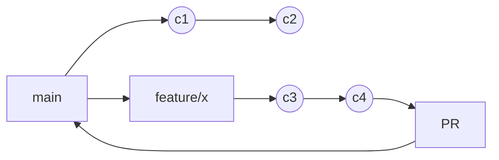

# Concepts

## Commits
- Small, focused snapshots with clear messages
- Use imperative mood ("Add", "Fix", "Update")

## Branches
- Isolated lines of work; prefer short-lived `feature/*`
- Keep `main` releasable; branch protection enabled

## Remotes
- `origin` on GitHub; push branches, open PRs; clone often via SSH

## History
- Linear history via rebase; avoid merge bubbles unless needed

## Messages
- Subject <= 50 chars; blank line; optional body wrapped at 72 chars

## Diagram

