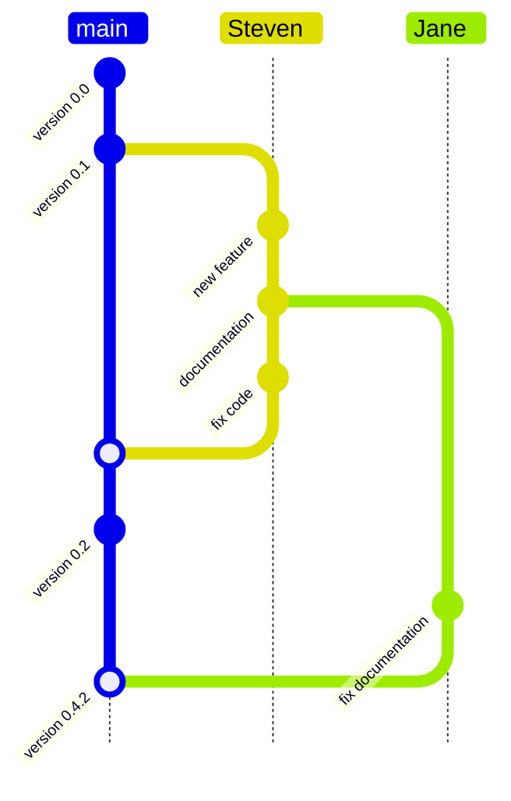

# What is Git?

## A Distributed Version Control System

Git is a free and open-source tool designed to help researchers and developers:

- Track changes in their files over time.
- Collaborate with others on the same project.
- Experiment with new ideas without fear of losing progress.

### Key Features of Git

1. **Version History:** Keep a detailed history of every change made to your files.
2. **Branching:** Create separate branches to work on new features or fixes.
3. **Merging:** Combine changes from different branches seamlessly.
4. **Distributed:** Work offline—Git stores the entire repository locally.
5. **Speed:** Perform operations like commits and branching quickly.

Git is the foundation for reproducible, collaborative research coding.

### Visualizing Branches and Merges

