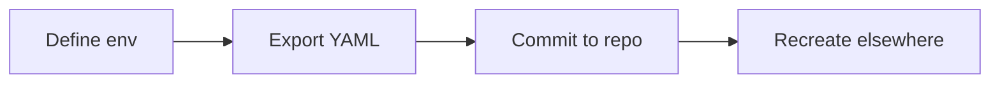

# Conda Environments — Quick Tutorial

Learn to create, reproduce, and share Conda environments.

## Create an environment
```bash
conda create -n gce-handbook python=3.11
conda activate gce-handbook
pip install -r requirements.txt  # or: conda install pandas numpy
```

## Export for sharing
```bash
conda env export --from-history > environment.yml
```

Tip: `--from-history` avoids pinning every transient dependency; for exact reproducibility, consider `conda-lock`.

## Faster solves
```bash
# optional but faster
conda install -n base conda-forge::mamba
mamba env create -f environment.yml
```

## Use in Snakemake
```bash
snakemake -c2 --use-conda
# In rules, set: conda: "envs/myrule.yml"
```

## Use in Nextflow
```bash
nextflow run main.nf -with-conda environment.yml
```

## Good practices
- Keep `environment.yml` at repo root or under `envs/`
- Prefer channels: `conda-forge` first
- Pin major versions; avoid over-pinning micro versions

## Exercises
1) Create an env with Python 3.11 and pandas; export `environment.yml`.
2) Recreate the env from `environment.yml` on another machine.
3) Add Snakemake to the env and run a tiny rule that prints versions.

## Checklist
- [ ] `environment.yml` committed
- [ ] Channel order includes conda-forge
- [ ] Instructions to create/activate env in README

## Diagram: flow

