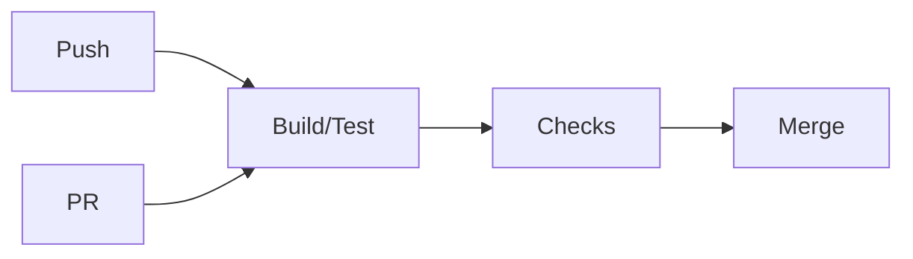

# GitHub Actions Basics — Quick Tutorial

Automate CI tasks with simple YAML workflows in `.github/workflows/`.

## Minimal workflow
```yaml
name: CI
on: [push, pull_request]
jobs:
	test:
		runs-on: ubuntu-latest
		steps:
			- uses: actions/checkout@v4
			- uses: actions/setup-python@v5
				with:
					python-version: '3.11'
					cache: 'pip'
			- run: pip install -r requirements.txt
			- run: pytest -q
```

## Tips
- Use `actions/cache` via `setup-python` or directly for speed
- Use matrices for multi-version tests
- Protect `main` and require checks on PRs

## Exercises
1) Add a `pages-build-deployment` job to publish MkDocs.
2) Add a test matrix for Python 3.10–3.12 and `ubuntu-latest`.
3) Cache dependencies by hashing `requirements.txt`.

## Checklist
- [ ] Workflows in `.github/workflows/`
- [ ] Status checks required on PRs
- [ ] Cache configured for dependencies
- [ ] Secrets not printed to logs

## Diagram: CI flow

