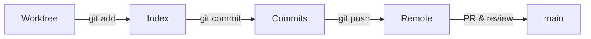

# Git Tutorial — Printable Summary

This page condenses the key concepts from the Slidev Git tutorial into a printable/reference-friendly format.

## Essentials
- Repository: a project folder tracked by Git (`.git`)
- Commit: snapshot of changes with a message
- Branch: a movable pointer to a line of commits (e.g., `main`, `feature/x`)
- Remote: a hosted copy (e.g., GitHub) you `push`/`pull` to

## Core workflow
1. Clone or init
2. Create a branch for your change
3. Stage and commit small, meaningful changes
4. Push branch to origin
5. Open PR, get review, merge

## Everyday commands
```bash
# setup
git config --global user.name "Your Name"
git config --global user.email "you@example.org"

# start a repo
git init

# work and commit
git status
git add <files>
git commit -m "Short, imperative message"

# branch & sync
git switch -c feature/my-change   # or: git checkout -b feature/my-change
git push -u origin feature/my-change

git pull --rebase                 # keep a linear history

# merge via PR (on GitHub UI), locally if needed
git switch main
git merge --ff-only feature/my-change  # or squash via GitHub
```

## Practical tips
- Commit early and often; one topic per commit
- Write clear messages; reference issues (e.g., "Fix #123")
- Use `.gitignore` and `.gitattributes` for noise/binaries
- Protect `main` and require PR reviews
- Use tags and releases for versions; keep a `CHANGELOG.md`

## Collaboration & conflicts
- Pull frequently; rebase your branch on `main`
- Resolve conflicts with a diff tool; test after resolving
- Avoid committing secrets; rotate credentials if exposed

## Branching model (suggested)
- `main`: always releasable
- `feature/*`: short-lived changes
- `release/*` (optional): prep release notes/testing
- `hotfix/*`: urgent fixes based off latest release

## Useful configs
```bash
git config --global pull.rebase true
git config --global init.defaultBranch main
```

For the full, interactive slides, see the embedded version or open: https://globalchangeecology.github.io/git_tutorial/

---

Print this page

<button onclick="window.print()" style="padding:6px 10px;border:1px solid var(--md-default-fg-color--lightest);border-radius:4px;background:var(--md-primary-fg-color);color:white;cursor:pointer;">Print</button>

## Quick exercises
1) Create a new repo, add a README, and push to GitHub.
2) Open a feature branch, commit a small change, open a PR.
3) Resolve a simulated conflict: edit the same line on `main` and your branch.

## Checklist
- [ ] Git configured (name, email)
- [ ] Default branch set to `main`
- [ ] `.gitignore` appropriate for the project
- [ ] Branch protection on `main`
- [ ] Releases use tags and changelog

## Diagram: basic workflow


