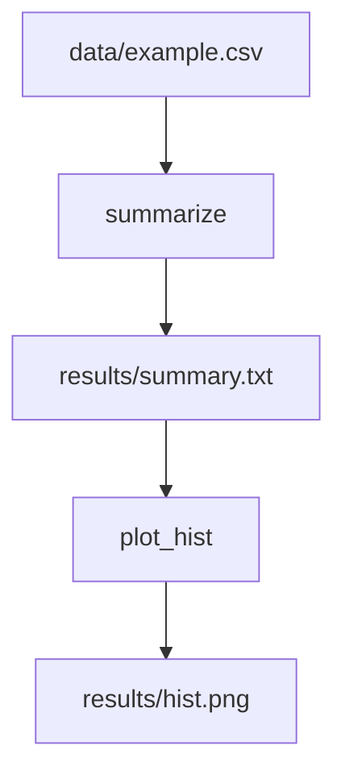

# Snakemake Basics — Quick Tutorial

Snakemake lets you define workflows as rules with inputs/outputs.

## Minimal Snakefile
```python
rule all:
	input: "results/summary.txt"

rule summarize:
	input: "data/example.csv"
	output: "results/summary.txt"
	conda: "envs/summarize.yml"
	shell: "python scripts/summarize.py {input} > {output}"
```

## Run locally
```bash
snakemake -c2 --use-conda
```

## Tips
- Use `--cores N` to parallelize
- Put envs under `envs/` and scripts under `scripts/`
- Track outputs in `results/` and avoid writing to inputs
- Use `resources:` for memory/time; profiles for HPC

## Exercises
1) Add a rule to plot a histogram (`matplotlib`) from the summary.
2) Parameterize input via a config file (`config.yaml`).
3) Add a unit test for `summarize.py` and run it in a CI job.

## Checklist
- [ ] Snakefile at repo root
- [ ] Results written to `results/`
- [ ] Conda envs defined per rule or shared
- [ ] Minimal README with run instructions

## Diagram: DAG example

